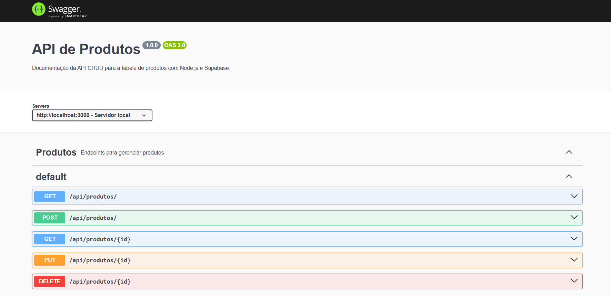

## API de Cliente com Node.js e Supabase
```
Este é um projeto de API RESTful para gerenciar Cliente, desenvolvido com Node.js, Express, Supabase e 
documentado com Swagger. A API suporta as operações básicas de CRUD (Criar, Ler, Atualizar e Deletar).
```

#### Preview


### 🚀 Começando

Siga os passos abaixo para clonar o projeto e rodar a API em sua máquina local.

1.  **Pré-requisitos**:
    * [Node.js](https://nodejs.org/) (versão 18 ou superior)
    * Uma conta no [Supabase](https://supabase.com/)

2.  **Configuração do Supabase**:
    * Crie um novo projeto no Supabase.
    * No **Table Editor**, crie a tabela `tb_cliente` com a seguinte estrutura SQL:
        ```sql
            create table public.tb_cliente (
                id bigint generated by default as identity not null,
                created_at timestamp with time zone not null default now(),
                nome text not null,
                cnpj text not null,
                segmento text not null,
                cep text not null,
                endereco text not null,
                numero text not null,
                bairro text not null,
                cidade text not null,
                estado text not null,
                constraint tb_cliente_pkey primary key (id),
                constraint tb_cliente_cnpj_key unique (cnpj),
                constraint tb_cliente_nome_key unique (nome)
            ) TABLESPACE pg_default;
        ```
    * Em **Project Settings > API**, copie sua **URL** e a **`anon` API Key**.
    * Crie um arquivo `.env` na raiz do projeto e adicione suas chaves:
        ```env
        SUPABASE_URL=sua-url-do-projeto-aqui
        SUPABASE_KEY=sua-anon-key-aqui
        PORT=3000
        ```

3.  **Instalação e Execução**:
    * Clone este repositório.
    * Instale as dependências:
        ``` API
        npm install
        node src/swagger.js
        ```
    * Inicie o servidor de desenvolvimento:
        ``` Web Frontend
        npm install
        npm run dev
        ```
    * A API estará rodando em `http://localhost:3000`.

---

### 📚 Documentação da API

A documentação interativa da API, gerada com **Swagger**, está disponível no seguinte endereço. 
Utilize-a para explorar e testar todos os endpoints.

* **URL da Documentação**: `http://localhost:3000/api-docs`

---

### 🔑 Endpoints da API

A API expõe os seguintes endpoints de CRUD para a rota `/api/cliente`.

| Método | Endpoint | Descrição |
| :--- | :--- | :--- |
| **GET** | `/api/cliente` | Lista todos os clientes. |
| **GET** | `/api/cliente/{id}` | Busca um cliente específico por ID. |
| **POST** | `/api/cliente` | Cria um novo cliente. |
| **PUT** | `/api/cliente/{id}` | Atualiza um cliente existente. |
| **DELETE** | `/api/cliente/{id}` | Exclui um cliente por ID. |

---

### Exemplo de Requisições

#### **POST /api/cliente** (Criar um novo cliente)

* **URL**: `http://localhost:3000/api/cliente`
* **Corpo da Requisição**:
    ```json
    {
        "nome": "Face Time ID",
        "cnpj": "00345678000188",
        "segmento": "Tecnologia",
        "cep": "12345678",
        "endereco": "Rua das Flores",
        "numero": "1000",
        "bairro": "Jardim das Rosas",
        "cidade": "São Paulo",
        "estado": "SP"
    }
    ```

#### **PUT /api/cliente/{id}** (Atualizar um cliente)

* **URL**: `http://localhost:3000/api/cliente/1`
* **Corpo da Requisição**:
    ```json
    {
        "bairro": "Jardim das Rosas",
        "cidade": "São Paulo",
        "estado": "SP"
    }
    ```

---

### 📦 Dependências do Projeto

* `express`: Framework web para Node.js.
* `@supabase/supabase-js`: Cliente oficial do Supabase.
* `dotenv`: Para gerenciar variáveis de ambiente.
* `swagger-ui-express`: Serve a documentação do Swagger.
* `swagger-autogen`: Gera o arquivo JSON do Swagger automaticamente.
* `nodemon`: Reinicia o servidor automaticamente em cada alteração.